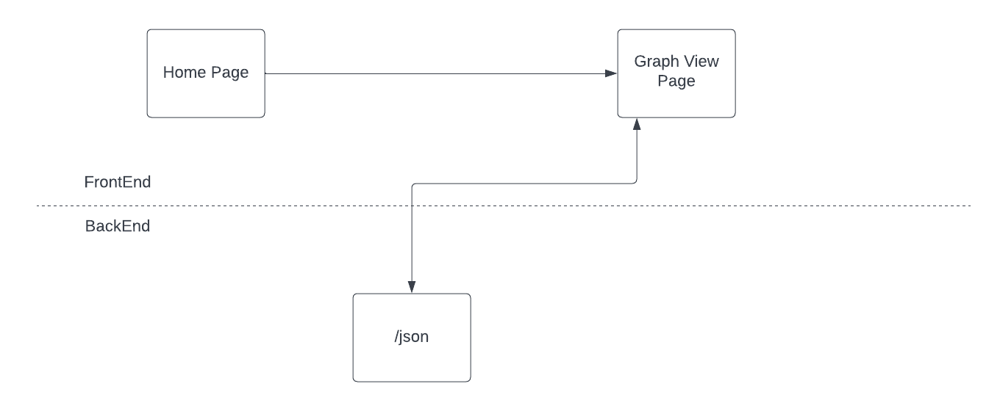

# Web App Architecture

## Front End

### Home Page

- index.html
- The home page will display a text box asking for input on how many nodes the user wants generated
- It will then send this information as a parameter in the url to graph.html

### Graph View Page

- graph.html
- This page grabs the url parameter that contains the amount of nodes needed to be generated
- With this it then sends this parameter to /json api in order to generate the graph on the page
- There is also a button that on click will call /dfs to start the dfs visualization using vis.js

## Back End

### /json

- index.js
- This api takes in the amount of nodes to be generated and creates json that will be consumed by the front end
- It randomly generates edges between each node, so each graph is different and can be more complex than others

### /dfs

- This will take in the graph created by /json and will then return json that contains the moves needed for dfs
- Helps the front end know which node should be colored as current

## Architecture

